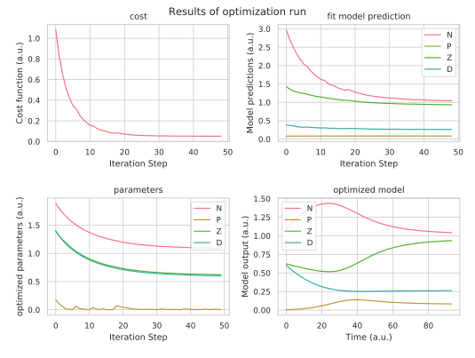

# General Ecosystem Modeling Framework

GEMF is a ecosystem modelling framework written in python.
It is designed to offer an easy to use method for modelling ecosystems with low- to intermediate complexity.  
The framework offers the functionality to handle non-equilibrium, non-linear interactions.
For the typical use-cases, user do need to write any code but only provide a model configuration.
The use-cases can easily be extended with simple user written functions without needing to change any of the framework code.  
The framework offers an easy to use method that fits any parameter of the model to mimic the studied system.
For simplicity, the current version of the framework is limited to non-spatially resolved models (box-models).


## Installation

### On Linux
Python and its package manger (pip) should be preinstalled.
Hence, it can simply be installed through:
``` bash
pip install gemf
```

### On Windows:
Get the latest python version from here.
For example the 3.8.3 version installer
This also installs pythons integrated package manager (pip).  
Then, the following install command can be used in windows "powershell":
``` powershell
python -m pip install gemf
```

## Quick Start

See examples.py. For a set of exemplary framework configurations see [configuration_files](configuration_files/)


## Usage


``` python
import gemf as 

# A model configuration is defined in a yaml file. To read this file:
model = gemf.load_configuration('path/to/model_configuration.yml')

# To draw a graph visualizing the model configuration:
gemf.interaction_graph(model)

# To solve the time integration of this model call:
forward_results = gemf.forward_model(model)
# To also solve the inverse problem as defined in the configuration, call:
inverse_results = gemf.inverse_model(model)

# To plot the results call 
gemf.plot.output_summary(inverse_results)
```

For details on the yaml configuration file, see [README_YAML.md](README_YAML.md)  
The presented functions offer many (crucial) options, which are discussed in the [documentation](doc/index.md).


## How does it work?

For a conceptual description of the internals of this library, see [README_concept.md](README_concept.md)


## Example

A simple example might be a simple NPZD model as presented below:


The user needs to define the compartments and interactions between them.
If the model should be fitted, they also need to provide some constraints and some data to fit it to.  
After that the model automatically generates a graph to visualize the system and to find potential errors in the configuration.

Once the model is configured the framework handles the time integration as well as the fitting without any further required user-interaction.


The results of such a run might then look like the following:


Top left shows the cost of the current model configuration. The cost is a quadratic measure of distance of the current model to the desired model.
Top right shows a output of the model after it reached its steady state for every parameter set tested.
Bottom left shows the all tested parameters sets.
Bottom right shows the full model output of the best fitted model found.