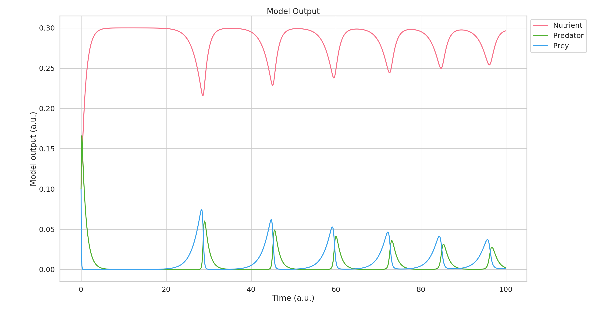
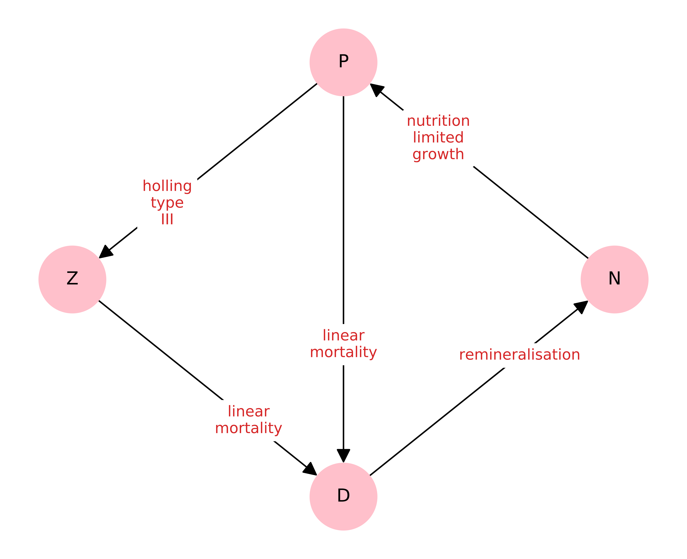
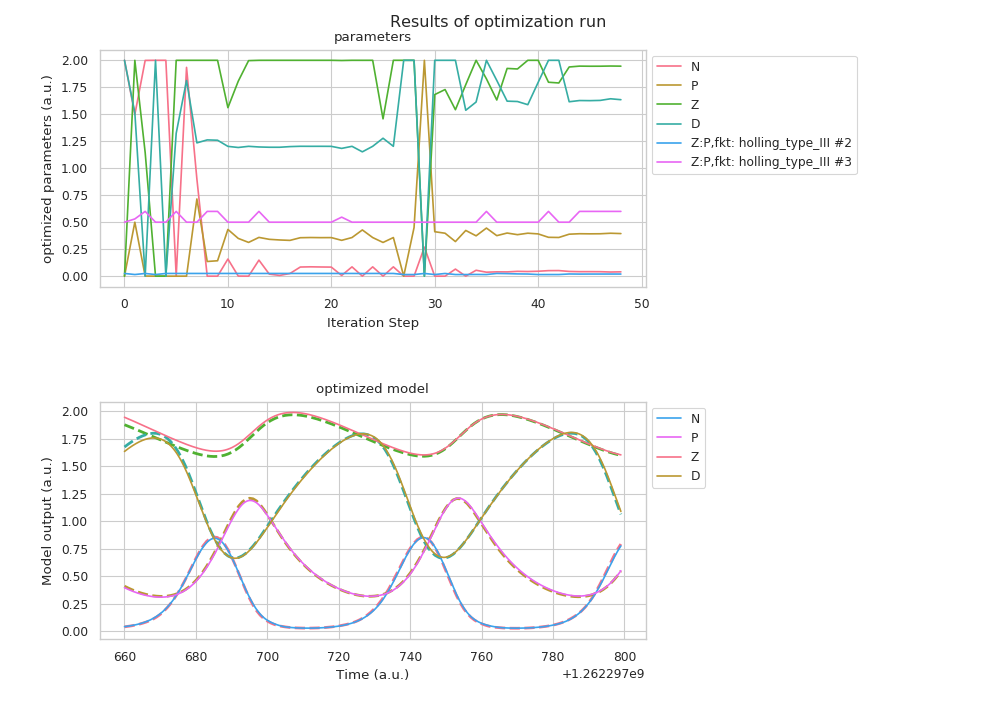

# Examples

We will present some small examples in full to show what the model can be used 
for and how.

## Predator-Prey

The probably most famous ecosystem model is the so called "Lotka-Volterra" 
model.
It has been developed in the 1920s and was designed to  described the population
dynamics of hares and lynxes.
It is described by the following set of equations,


where *x* and *y* represent the predator and prey populations, while the remaining
variables are constants.


While famous, this minimalistic predator-prey model is not "closed".
Hence, it implicitly depends on external compartments,  most importantly 
nutrients for the prey.
We present a closed extension of this model, where the predator dies, is 
transformed in some form of nutrient and consumed by the prey.

The interaction graph of this model is presented below.


This graph is generated by the NEMF framework base on the following 
*YAML-configuration-file*:

``` YAML
# List of all present compartments in the model.
compartment:
  Nutrient:
    value: 0.1
    optimise:
  
  Predator:                       # name of the compartment
    value:  0.1                   # initial value of the compartment
    optimise:                     # if the above value shall not be optimized,
                                  #this remains empty
  Prey:
    value: 0.1
    optimise:

# List of all interactions/flows between compartments
interactions:
  Prey:Nutrient:                  # names of the interacting compartments
  - fkt: holling_type_I           # name of the type of interaction 
    parameters:                   # list of parameters required for interaction
    - 'Nutrient'                  # Parameters can also be other compartments
    - 2
    optimise:                     # whether or not some of these parameters
                                  # shall be optimized
  Predator:Prey:
  - fkt: holling_type_I
    parameters:
    - 'Prey'
    - 100

  Nutrient:Predator:
  - fkt: linear_mortality
    parameters:
    - Predator
    - 1
    
# list of details for the forward and inverse modelling modules
configuration:
  # time evolution / forward modelling
  time_evo_max: 100
  dt_time_evo: 0.1
```
You can read more about the *YAML configuration file*  [here](manual/YAML.md).

To create the graph and also calculate a forecast/time-evolution of the model
we execute the following lines of code:
``` python
import nemf

# provide the path of model/system configuration
model_path = 'path/to/the/yaml/file/presented/above/example.yml'

# load the model configuration
model_config = nemf.model_class(model_path)

# visualise the model configuration to check for errors
nemf.interaction_graph(model_config)

# for a time evolution of the model call:
output_dict = nemf.forward_model(model_config)

# the results of the time evolution can be visualized with:
nemf.output_summary(output_dict)
```
To read more about the functions present in the NEMF framework, take a look at 
the [API references](api.rst).

This generates both the graph as shown above, and also the following 
time-evolution of the model:



## NPZD-Model (Nutrient-Phytoplankton-Zooplankton-Detritus)

The simple Predator Prey example presented the fundamentals of the Framework.
In the NPZD example used in the [introduction](introduction.md) we also 
presented the inverse- or fitting-capabilities of the framework which we will 
present now.

The model interaction graph looks like this:


This model is a little more complicated.
Hence, the configuration file will also be a little longer.

Note especially how we declare which parameters shall be fitted and the range in
which the fitted value shall remain.
``` yaml
# List of all present compartments in the model.
compartment:
  N:              # name of the compartment
    value:  1     # initial value of the compartment
    optimise:     # if the above value shall not be optimized this remains empty
      lower: 1.0e-9    # if not, lower and
      upper: 2         # upper constraints must be defined 
  P:
    value: 1 #.20835024e+00
    optimise:
      lower: 1.0e-9
      upper: 2
  Z:
    value: 1 #8.84333950e-01
    optimise:
      lower: 1.0e-9
      upper: 2
  D:
    value: 1 # 8.57333742e-01
    optimise:
      lower: 1.0e-9
      upper: 2

# List of all interactions/flows between compartments
interactions:
  
  P:N:                            # names of the interacting compartments
  - fkt: nutrient_limited_growth  # name of the type of interaction 
    parameters:                   # list of parameters required for interaction
    - 'N'                         # Parameters can also be other compartments
    - 0.27
    - 0.7
    optimise:                     # whether or not some of these parameters
                                  # shall be optimized
  Z:P:
  - fkt: holling_type_III
    parameters:
    - 'P'
    - 0.02
    - 0.575 
    optimise:
      - parameter_no: 2
        lower: 0.015
        upper: 0.025
      - parameter_no: 3
        lower: 0.5
        upper: 0.6
  D:P:
  - fkt: linear_mortality
    parameters:
    - 'P'
    - 0.04
    optimise:
  D:Z:
  - fkt: linear_mortality
    parameters:
    - 'Z'
    - 0.01
    optimise:
  N:D:
  - fkt: remineralisation
    parameters:
    - 'D'
    - 0.148
    optimise:


# list of details for the forward and inverse modelling modules
configuration:
  # time evolution / forward modelling
  time_evo_max: 1000
  dt_time_evo: 1
```

For the framework to fit we also need a date set to be used.
It will then try to find a model configuration (in the allowed constraints)
that lies closest to the reference data points.

For our example we use the following data set:
``` csv
'Datetime','N','P','Z','D'
1.262297670e+09,1.51e-01,3.15e-01,1.74e+00,1.79e+00
1.262297681e+09,7.22e-01,4.97e-01,1.60e+00,1.17e+00
1.262297692e+09,5.23e-01,1.13e+00,1.66e+00,6.69e-01
1.262297703e+09,4.98e-02,9.03e-01,1.94e+00,1.09e+00
1.262297714e+09,2.82e-02,4.97e-01,1.93e+00,1.54e+00
1.262297725e+09,8.95e-02,3.29e-01,1.79e+00,1.79e+00
1.262297736e+09,5.07e-01,3.92e-01,1.64e+00,1.45e+00
1.262297747e+09,7.57e-01,9.44e-01,1.60e+00,6.88e-01
1.262297758e+09,9.99e-02,1.07e+00,1.89e+00,9.35e-01
1.262297769e+09,2.52e-02,5.88e-01,1.95e+00,1.42e+00
1.262297780e+09,5.41e-02,3.58e-01,1.83e+00,1.74e+00
1.262297791e+09,3.04e-01,3.30e-01,1.68e+00,1.67e+00
```
Read more about the reference data format [here](manual/reference_data.rst).

To tell the framework to perfore a fitting-run we execute the following small 
script. It will also generate the interaction graph above and will draw a
plot presenting the result.


``` python
import nemf

# provide the path of model/system configuration
model_path = 'path/to/the/yaml/file/presented/above/example.yml'
reference_data_path = 'path/to/the/data/file/representing/the/model_ref.csv'

# load the model configuration
model_config = nemf.model_class(model_path)

# visualise the model configuration to check for errors
nemf.interaction_graph(model_config)

# for a simple time evolution of the model call:
output_dict = nemf.inverse_model(model_config)

# the results of the time evolution can be visualized with:
nemf.output_summary(output_dict)
```

which will create the following plot:


In the top you can see the different set tested during the fitting process.
The bottom half shows the "fitted" model time evolution, 
which represents the frameworks best guess for the parameters.
The reference data points are shown as dashed lines.


## Enzymatic Reaction

[placesholder]


